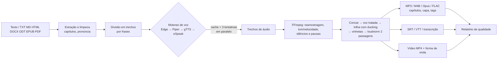

# Texto para Áudio


[](https://github.com/italofelipe01/texto_to_audio/actions/workflows/ci.yml)

Converte textos e documentos em **áudio com qualidade de estúdio** usando **vozes neurais gratuitas** e uma **cadeia completa de pós-produção com FFmpeg** — tudo automatizado, com interface web, linha de comando e pasta monitorada.

> Escreva (ou solte um PDF/EPUB/DOCX) → escolha um perfil → receba MP3/M4B com capítulos, legendas sincronizadas, vídeo para YouTube/Reels e um relatório de qualidade.

---

## Sumário

- [Destaques](#destaques)
- [Início rápido](#início-rápido)
- [Interface web](#interface-web)
- [Linha de comando](#linha-de-comando)
- [Automação: pasta monitorada](#automação-pasta-monitorada)
- [Perfis prontos](#perfis-prontos)
- [Motores de voz gratuitos](#motores-de-voz-gratuitos)
- [Pós-produção com FFmpeg](#pós-produção-com-ffmpeg)
- [Formatos de entrada e saída](#formatos-de-entrada-e-saída)
- [Dicionário de pronúncia](#dicionário-de-pronúncia)
- [Configuração](#configuração)
- [API REST](#api-rest)
- [Arquitetura](#arquitetura)
- [Desenvolvimento](#desenvolvimento)
- [Solução de problemas](#solução-de-problemas)
- [Uso responsável e licenças](#uso-responsável-e-licenças)

## Destaques

- **Vozes neurais gratuitas, sem chave de API**: Microsoft Edge Neural (online) e **Piper** (100% offline), com gTTS e eSpeak NG como reserva.
- **Fallback automático**: se a internet cair ou um serviço falhar, o próximo motor assume sozinho, sem intervenção.
- **Pós-produção profissional com FFmpeg**: reamostragem SoX, velocidade e tom com Rubber Band (preservando formantes), remoção de silêncios, EQ de presença, de-esser, compressor, **loudness EBU R128 em 2 passagens**, trilha de fundo com **ducking automático**, vinhetas, capas e **capítulos**.
- **Entregáveis prontos**: MP3, M4B (audiobook), M4A, Opus, FLAC e WAV; legendas **SRT/WebVTT**; **vídeo MP4** (16:9, 9:16 ou 1:1) com forma de onda, título e legendas embutidas; imagem da forma de onda; relatório técnico.
- **Lê documentos**: TXT, Markdown, HTML, DOCX, ODT, EPUB e PDF. Títulos viram capítulos automaticamente.
- **Interface web** responsiva, com amostra de voz, progresso em tempo real, player com forma de onda e **transcrição sincronizada** (destaca a frase falada).
- **Mínimo de intervenção manual**: Docker com tudo incluído, pasta monitorada, cache de trechos (re-execuções instantâneas), novas tentativas automáticas, limpeza automática de jobs antigos e `tta doctor` para diagnóstico.

## Início rápido

### Opção 1 — Docker (recomendado: nada para instalar além do Docker)

```bash
git clone https://github.com/italofelipe01/texto_to_audio.git
cd texto_to_audio
docker compose up -d --build
```

- Interface web: **http://localhost:8000**
- Pasta monitorada: coloque arquivos em `./data/entrada` e pegue o resultado em `./data/saida`.

A imagem já inclui FFmpeg completo, eSpeak NG e a voz offline `pt_BR-faber-medium` (Piper).

### Opção 2 — Instalação local

Requisitos: **Python 3.11+** e **FFmpeg 6+** no PATH.

```bash
# FFmpeg
sudo apt install ffmpeg            # Ubuntu/Debian
brew install ffmpeg                # macOS
winget install Gyan.FFmpeg         # Windows

# Projeto (interface web + PDF + voz offline)
python -m venv .venv && source .venv/bin/activate   # Windows: .venv\Scripts\activate
pip install -e ".[all]"

tta doctor        # confere FFmpeg, filtros e motores de voz
tta serve         # interface web em http://127.0.0.1:8000
```

> `pip install -r requirements.txt` também funciona (instala web + PDF, sem o Piper).

## Interface web

`tta serve` (ou Docker) abre uma interface em português com:

1. **Conteúdo** — digite/cole o texto (com contador e duração estimada) ou arraste um arquivo.
2. **Perfil de saída** — Padrão, Audiobook, Podcast, Acessibilidade, Vídeo (YouTube), Vídeo vertical e Rascunho.
3. **Voz** — idioma, motor, voz, velocidade e tom, com botão **Ouvir amostra**.
4. **Pós-produção FFmpeg** — formatos, alvo de loudness, true peak, tratamento de voz e pausas.
5. **Trilha e vinhetas** — música de fundo com ducking, abertura e encerramento.
6. **Vídeo, legendas e capa** — MP4 16:9/9:16/1:1, visualização, legendas embutidas, capa.
7. **Metadados e pronúncia** — autor, álbum e dicionário de pronúncia.

O resultado aparece com player (forma de onda clicável, velocidade 0,75×–2×), capítulos, transcrição que acompanha a leitura, downloads individuais ou em `.zip` e um painel de qualidade (loudness medida, pico, LRA, motor usado, cache). O histórico fica salvo no servidor e as preferências no navegador. Atalho: <kbd>Ctrl</kbd> + <kbd>Enter</kbd> gera o áudio.

> ⚠️ A interface não tem login. Para expor na internet, coloque-a atrás de um proxy com autenticação (ex.: Caddy/Nginx com basic auth).

## Linha de comando

```bash
# Texto direto
tta synth -t "Olá! Este é um teste." --play

# Um ou vários arquivos (cada um vai para uma subpasta de saída)
tta synth livro.epub capitulo.docx relatorio.pdf --preset audiobook -o saida/

# Escolhendo voz, velocidade e tom
tta synth roteiro.md --voice pt-BR-AntonioNeural --rate 10 --pitch -1

# Podcast com trilha, vinhetas e capa
tta synth episodio.md --preset podcast --music trilha.mp3 --intro vinheta.mp3 --cover capa.jpg

# Vídeo vertical para Reels/Shorts com legendas embutidas
tta synth post.txt --preset shorts --background fundo.jpg

# Ler da entrada padrão
cat artigo.txt | tta synth - --formats mp3,opus
```

Outros comandos:

| Comando | O que faz |
|---|---|
| `tta voices [--engine edge] [--lang pt-BR]` | Lista as vozes disponíveis |
| `tta presets` | Lista os perfis prontos |
| `tta doctor [--online] [--json]` | Diagnóstico: FFmpeg, filtros, encoders, motores, dependências e conectividade |
| `tta watch [pasta]` | Monitora uma pasta e converte o que chegar |
| `tta serve [--host 0.0.0.0] [--port 8000]` | Interface web |
| `tta download-voice pt_BR-faber-medium` | Baixa uma voz Piper para uso offline |
| `tta cache info\|prune\|clear` | Gerencia o cache de trechos |

Todas as opções: `tta synth --help`. O comando antigo continua funcionando:
`python src/tts_converter.py "texto" -o audio.mp3 --no-play`.

## Automação: pasta monitorada

```bash
tta watch data/entrada -o data/saida --preset audiobook
```

```
data/entrada/              ← solte .txt .md .html .docx .odt .epub .pdf aqui
data/entrada/livro.json    ← (opcional) opções só para "livro.*"
data/entrada/processados/  ← originais movidos após sucesso
data/entrada/falhas/       ← originais + livro.pdf.erro.txt explicando o problema
data/saida/livro/          ← áudio, legendas, vídeo e relatório
```

O arquivo de opções (`<mesmo-nome>.json`) aceita os mesmos campos da API, e caminhos relativos (capa, trilha) são resolvidos a partir da pasta de entrada. Veja [`exemplos/audiobook.json`](exemplos/audiobook.json). No Docker, o serviço `watcher` já faz isso continuamente.

## Perfis prontos

| Perfil | Saídas | Loudness | Detalhes |
|---|---|---|---|
| `padrao` | MP3 + SRT/VTT | -16 LUFS / -1,5 dBTP | Voz tratada, capítulos |
| `audiobook` | M4B + MP3 | -18 LUFS / -3 dBTP | 44,1 kHz, ritmo -5%, pausas longas, capítulos (compatível com o padrão ACX) |
| `podcast` | MP3 | -16 LUFS / -1 dBTP | EQ + de-esser + compressor, trilha a -18 dB com ducking |
| `acessibilidade` | MP3 + Opus | -16 LUFS | Fala 10% mais lenta, pausas maiores, transcrição sincronizada |
| `video` | MP3 + MP4 1920×1080 | -14 LUFS / -1 dBTP | Forma de onda, título e legendas embutidas |
| `shorts` | MP3 + MP4 1080×1920 | -14 LUFS / -1 dBTP | Legendas grandes para Reels/Shorts/TikTok |
| `rascunho` | MP3 | sem normalização | O mais rápido, para revisar o texto |

Qualquer opção pode ser sobrescrita (ex.: `--preset audiobook --rate 0`).

## Motores de voz gratuitos

| Motor | Qualidade | Internet | Velocidade | Observações |
|---|---|---|---|---|
| **Edge Neural** (`edge`) | ★★★★★ neural | Sim | nativa | Vozes pt-BR Francisca, Antonio e Thalita (multilíngue). Informa limites de frases → legendas mais precisas. |
| **Piper** (`piper`) | ★★★★ neural | Não | nativa | Roda local e privado. Vozes pt-BR: faber, cadu, jeff, edresson. Baixa o modelo (~60 MB) no 1º uso. |
| **gTTS** (`gtts`) | ★★★ | Sim | via FFmpeg | Voz do Google Tradutor; sotaques pt-BR e pt-PT. |
| **eSpeak NG** (`espeak`) | ★★ robótica | Não | nativa | Último recurso, sempre disponível (`apt install espeak-ng`). |

No modo `auto` a ordem é **Edge → Piper → gTTS → eSpeak**. Cada trecho tem até 3 tentativas com espera crescente; se um motor falhar de vez, o job inteiro é refeito com o próximo (para não misturar vozes) e o relatório registra o motivo.

## Pós-produção com FFmpeg

| Etapa | Filtros / recursos | Para quê |
|---|---|---|
| Normalização dos trechos | `aresample` (SoX, precisão 28 bits), `aformat` | Formato único 48 kHz mono, alta fidelidade |
| Velocidade e tom | `rubberband` (formantes preservados) ou `atempo`/`asetrate` | Mudar ritmo/tom sem “voz de esquilo” |
| Ritmo | `silenceremove` + `areverse` + `apad` | Remove silêncios das pontas e aplica pausas consistentes (frase, parágrafo, capítulo) |
| União | concat demuxer (`-c copy`) | Junta centenas de trechos sem perdas |
| Tratamento de voz | `highpass`, `equalizer`, `deesser`, `acompressor` | Corta ruído grave, dá presença, reduz “s” sibilantes, uniformiza a dinâmica |
| Trilha e vinhetas | `-stream_loop`, `adelay`, `sidechaincompress`, `amix`, `afade`, `concat` | Música em loop que abaixa sozinha quando a voz fala, com fade e vinhetas |
| Loudness | `loudnorm` em **2 passagens** (modo linear) | Volume padronizado (EBU R128) sem distorção |
| Codificação | `libmp3lame`, `aac`, `libopus`, `flac`, `pcm_s16le` | Formatos para cada plataforma |
| Metadados | FFMETADATA, ID3v2, `attached_pic` | Título, autor, álbum, **capítulos** e **capa** embutidos |
| Visual | `showwavespic`, `showwaves`, `showfreqs`, `drawtext`, `subtitles` (libass) | Imagem da onda, vídeo com onda/barras, título e legendas |
| Controle de qualidade | `loudnorm` (medição), `ffprobe` | Relatório com LUFS integrados, true peak e LRA |

Detalhes e comandos equivalentes: [`docs/PIPELINE.md`](docs/PIPELINE.md).

## Formatos de entrada e saída

**Entrada:** `.txt`, `.md`, `.markdown`, `.html`, `.htm`, `.xhtml`, `.docx`, `.odt`, `.epub`, `.pdf` (PDF precisa ter texto; digitalizados exigem OCR antes, ex.: `ocrmypdf`). Codificações UTF-8, Windows-1252 e Latin-1 são detectadas automaticamente. Títulos (`#` no Markdown, estilos “Título” no Word, `<h1>`… no HTML/EPUB, linhas como “Capítulo 3”) viram capítulos.

**Saída** (na pasta do job, com nome baseado no título):

| Arquivo | Conteúdo |
|---|---|
| `nome.mp3`, `.m4b`, `.m4a`, `.opus`, `.flac`, `.wav` | Áudio com metadados (e capítulos/capa quando o formato suporta) |
| `nome.srt`, `nome.vtt` | Legendas sincronizadas (até 2 linhas de 42 caracteres) |
| `nome.mp4` | Vídeo H.264/AAC com fundo, forma de onda, título e legendas |
| `nome.transcricao.json` | Frases com início/fim e capítulos (usado pelo player web) |
| `nome.onda.png`, `nome.picos.json` | Forma de onda em imagem e em dados |
| `nome.capa.jpg` | Capa quadrada 1400×1400 |
| `nome.relatorio.json` | Motor, voz, durações, loudness medida, tempos de cada etapa e opções usadas |

## Dicionário de pronúncia

Corrija siglas, nomes e termos técnicos sem alterar as legendas:

```text
IA = i a
TTS = tê tê ésse
FFmpeg = éfe éfe ém pég
```

Use `--lexicon arquivo.txt`, o campo da interface web, ou salve em `data/pronuncia.txt` para valer em todos os jobs. Termos em MAIÚSCULAS diferenciam maiúsculas de minúsculas. Exemplo: [`exemplos/pronuncia.txt`](exemplos/pronuncia.txt).

## Configuração

Tudo é opcional e definido por variáveis de ambiente (no Docker, copie `.env.example` para `.env`):

| Variável | Padrão | Descrição |
|---|---|---|
| `TTA_DATA_DIR` | `data` | Pasta base (saídas, cache, jobs, vozes) |
| `TTA_OUTPUT_DIR` | `data/saida` | Saída do CLI e da pasta monitorada |
| `TTA_ENGINE` | `auto` | Motor padrão |
| `TTA_LANG` | `pt-BR` | Idioma padrão |
| `TTA_MAX_JOBS` | `2` | Jobs simultâneos na interface web |
| `TTA_MAX_WORKERS` | `4` | Trechos sintetizados em paralelo |
| `TTA_MAX_CHARS` | `500000` | Limite de caracteres por texto |
| `TTA_MAX_UPLOAD_MB` | `50` | Limite por arquivo enviado |
| `TTA_JOB_TTL_DAYS` | `7` | Apaga jobs concluídos após N dias (0 = nunca) |
| `TTA_CACHE_MAX_MB` | `2048` | Tamanho máximo do cache de trechos |
| `TTA_PIPER_VOICES_DIR` | `data/piper-voices` | Pastas de modelos Piper (separadas por `:`) |
| `TTA_PIPER_AUTO_DOWNLOAD` | `true` | Baixa a voz Piper no primeiro uso |
| `TTA_LEXICON` | `data/pronuncia.txt` | Dicionário de pronúncia global |
| `TTA_PROXY` | — | Proxy HTTP para o Edge TTS |
| `TTA_CA_BUNDLE` | — | Certificado extra para redes com inspeção TLS |
| `TTA_FFMPEG`, `TTA_FFPROBE` | `ffmpeg`, `ffprobe` | Caminhos alternativos dos binários |
| `TTA_KEEP_WORK` | — | Mantém a pasta temporária `.trabalho` (depuração) |

## API REST

Documentação interativa em `http://localhost:8000/docs`.

| Método | Rota | Descrição |
|---|---|---|
| `GET` | `/api/health` | Saúde do serviço |
| `GET` | `/api/capabilities` | Motores, recursos do FFmpeg, formatos, perfis e limites |
| `GET` | `/api/voices?engine=auto&lang=pt` | Vozes disponíveis |
| `POST` | `/api/preview` | Amostra curta em MP3 (`{"voice": "...", "rate": 0, "pitch": 0}`) |
| `POST` | `/api/jobs` | Cria um job (multipart: `options` JSON + `text` ou `file`, e opcionalmente `music`, `intro`, `outro`, `cover`, `background`, `lexicon`) |
| `GET` | `/api/jobs` · `/api/jobs/{id}` | Lista / detalha jobs |
| `GET` | `/api/jobs/{id}/events` | Progresso em tempo real (Server-Sent Events) |
| `POST` | `/api/jobs/{id}/cancel` | Cancela |
| `DELETE` | `/api/jobs/{id}` | Exclui o job e seus arquivos |
| `GET` | `/api/jobs/{id}/files/{nome}` · `/api/jobs/{id}/zip` | Baixa um arquivo (com suporte a Range) ou tudo em ZIP |

Exemplo:

```bash
curl -F 'options={"preset":"podcast","voice":"pt-BR-AntonioNeural"}' \
     -F 'file=@episodio.md' -F 'music=@trilha.mp3' http://localhost:8000/api/jobs
```

## Arquitetura



```
src/texto_to_audio/
├── cli.py            # comando "tta"
├── pipeline.py       # orquestração: texto → voz → FFmpeg → entregáveis
├── text.py           # leitura de arquivos, limpeza, frases, trechos, pronúncia
├── engines/          # edge, piper, gtts, espeak + fallback automático
├── ffmpeg.py         # todas as etapas de pós-produção
├── subtitles.py      # SRT, WebVTT e transcrição
├── presets.py        # opções de job e perfis prontos
├── cache.py          # cache de trechos sintetizados
├── watch.py          # pasta monitorada
└── web/              # API FastAPI + interface (HTML/CSS/JS sem build)
```

## Desenvolvimento

```bash
pip install -e ".[all,dev]"
make test      # pytest (não precisa de internet: usa um motor de voz falso + FFmpeg real)
make lint      # ruff
make format
```

O CI (GitHub Actions) roda lint e testes em Python 3.11, 3.12 e 3.13 e valida a imagem Docker a cada push/PR.

## Solução de problemas

| Sintoma | Solução |
|---|---|
| `FFmpeg/ffprobe não encontrados` | Instale o FFmpeg ou use o Docker. Rode `tta doctor`. |
| “Todos os motores de voz falharam” | Veja o motivo de cada motor na mensagem. Sem internet, instale o Piper (`pip install -e ".[piper]"`) e baixe a voz antes: `tta download-voice pt_BR-faber-medium`. |
| Erro de certificado no Edge em rede corporativa | Defina `TTA_CA_BUNDLE` com o certificado da empresa (e `TTA_PROXY` se houver proxy). |
| PDF sem texto | O PDF é digitalizado: aplique OCR (`ocrmypdf entrada.pdf saida.pdf`). |
| Pronúncia errada de siglas | Use o [dicionário de pronúncia](#dicionário-de-pronúncia). |
| Vídeo demorado | Vídeo 1080p é a etapa mais pesada; use `--video-style none` ou o formato quadrado. |
| Permissão negada em `./data` (Docker no Linux) | O contêiner ajusta as permissões no início; se persistir: `sudo chown -R 1000:1000 data`. |

## Uso responsável e licenças

- Código sob licença **MIT** — veja [LICENSE](LICENSE).
- O motor **Edge** usa o serviço de leitura em voz alta do Microsoft Edge por meio da biblioteca não oficial `edge-tts`; o **gTTS** usa o Google Tradutor de forma não oficial. Ambos podem mudar sem aviso e são indicados para uso pessoal, educacional e de acessibilidade. Para uso comercial em escala, prefira serviços oficiais (ex.: Azure AI Speech, que tem camada gratuita) ou o **Piper**, que roda localmente.
- Cada voz Piper tem a própria licença (veja o cartão do modelo em huggingface.co/rhasspy/piper-voices).
- Use trilhas e imagens livres de direitos ou de sua autoria.

Análise técnica completa da versão anterior e o que mudou: [`docs/ANALISE.md`](docs/ANALISE.md) · Histórico: [`CHANGELOG.md`](CHANGELOG.md).

## 👤 Autor

**Ítalo Felipe Lira de Morais**
